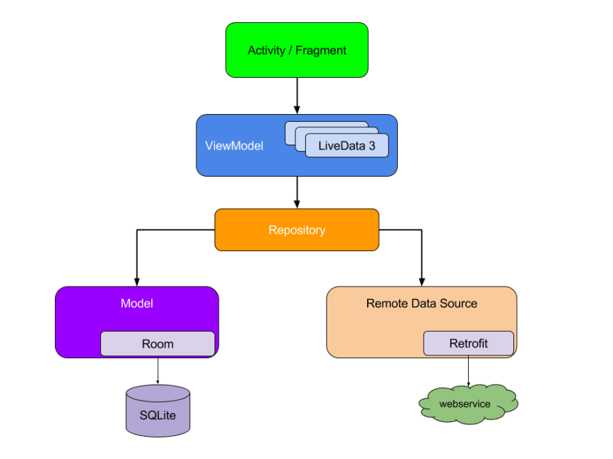

## CommCare Survey Manager
An Android App used by M&E and ICT4D Officers to manage the data collection frequency, visibility,
and access of modules, forms and questions of a given CommCare Mobile App.

### Architecture
